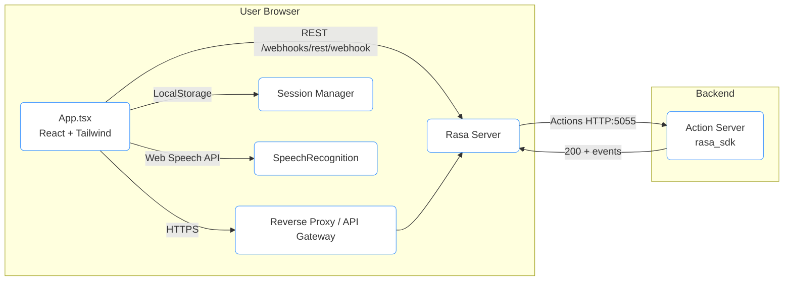
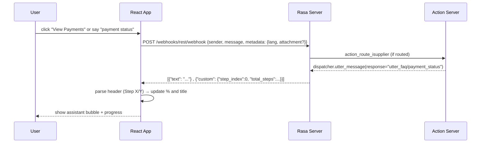
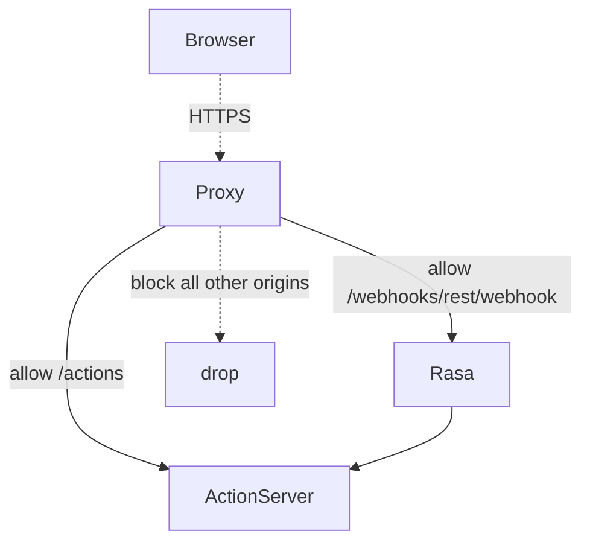
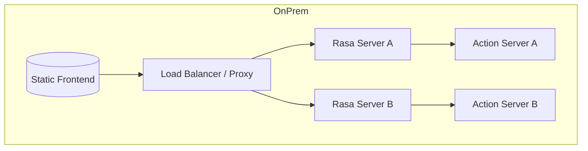
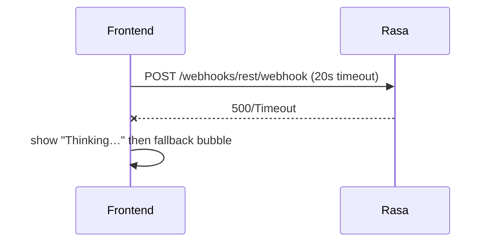

# TMPA i‑Supplier Assistant — Technical Architecture (v2)

> **Scope**: React (Vite) front‑end with voice input, session manager, Rasa 3.x NLU/Core, custom actions, and secure network layout.  
> **Status**: current working baseline after FAQ + quick actions fixes, screenshot rendering fix, and Web Speech integration.

---

## 1) System Overview



**Key components**  
- **Front‑end**: React + Vite + Tailwind; chat UI, quick actions, screenshot viewer modal, mic (Web Speech).  
- **Session Manager**: `localStorage` key `tmpa.sessionId`; rotatable via UI.  
- **Rasa Server**: NLU/Core, retrieval intents under the base `faq` intent; REST channel.  
- **Action Server**: Custom routing & flow navigation: `action_route_isupplier`, `action_next_step`, `action_back_step`, `action_reset_flow`.  
- **Reverse Proxy**: TLS, CORS, rate limits, optional token/header enforcement.

---

## 2) Front‑end (React / Vite)

### 2.1 Structure & Responsibilities

- **App.tsx**: top‑level layout (Topbar, Sidebar, Chat, RightSidebar).  
- **Chat**: stateful message list; sends to Rasa via `POST {RASA_URL}/webhooks/rest/webhook`.  
- **Quick Actions** (Left Sidebar): map to natural triggers (EN/FR) using `rasaTriggerFor()` then inject into Chat (`sendExternal`).  
- **Screenshots**: Rasa answers may include `image` → shows “View screenshot” button and modal.  
- **Progress**: parses assistant headers (`Supplier Registration — Step 1/7`) to update **RightSidebar** progress bar and title.  
- **Voice**: Web Speech API (`webkitSpeechRecognition`) for push‑to‑talk; transcript gets sent as normal text.



### 2.2 Session Manager

- **Where**: Front‑end only; `localStorage.tmpa.sessionId`.  
- **Generation**: `sess-<random><timestamp>`.  
- **Rotation**: UI button → generates new id and stores it; next messages reuse it.  
- **Scope**: Logical chat thread correlation; no PII and no backend persistence by default.

### 2.3 Security on the Client

- Sanitized rendering (no `dangerouslySetInnerHTML`).  
- CORS is restricted by the proxy (see §5).  
- Mic is opt‑in; explicit user action to start recording; no server transmission of raw audio.  
- Attachments: base64 sent in `metadata.attachment` only when the user selects a file.

---

## 3) Rasa (3.x) — NLU, Domain, Actions

### 3.1 Intents & Retrieval FAQ

- **Base intent**: `faq`.  
- **Sub‑intents** (training only): `faq/isupplier_overview`, `faq/portal_access`, `faq/invoices_status`, `faq/payment_status`, `faq/invoice_holds`, etc.  
- **Why**: ResponseSelector trains on the base `faq`, avoids full‑retrieval conflicts in rules.

### 3.2 Domain (slots, responses)

- **Slots**:  
  - `lang` (text) — manual, used for conditional responses (EN/FR).  
  - `active_flow` (text), `step_index` (float) — flow navigation state (set by actions).

- **Responses**: `utter_sr_step_1..7`, `utter_fp_step_1..4`, `utter_wc_step_1..4`, `utter_inv_step_1..6`, plus `utter_faq/...`.  
  Conditional variants based on `lang` (Rasa 3.x syntax with `condition: [{type: "slot", name: "lang", value: "EN"}]`).

### 3.3 Rules (conflict‑free)

- **Route flows** to `action_route_isupplier`.  
- **Next/Back/Stop** → `action_next_step` / `action_back_step` / `action_reset_flow` (+ `utter_cancelled`).  
- **FAQ**: single rule `intent: faq` → **utter** response (no `respond_faq` custom action).

### 3.4 Custom Actions (Python)

- **`action_route_isupplier`**:  
  - Keyword routing for EN/FR flows and **three deterministic quick actions**: invoices view/status, payments, holds.  
  - Emits `dispatcher.utter_message(response="utter_faq/...")` for FAQ quick tiles.  
  - Starts flows with `_send_step()` to set slots and push step JSON `{step_index, total_steps}`.

- **`action_next_step` / `action_back_step`**: step navigation guarded by active flow.  
- **`action_reset_flow`**: clear flow slots (rule will utter `utter_cancelled`).

---

## 4) Data Model & Message Contract

**Front‑end → Rasa** (REST channel):

```json
POST /webhooks/rest/webhook
{
  "sender": "sess-abc123...",
  "message": "payment status",
  "metadata": {
    "lang": "EN",
    "attachment": {
      "name": "invoice.pdf",
      "type": "application/pdf",
      "size": 123456,
      "data": "<base64>"
    }
  }
}
```

**Rasa → Front‑end**:

```json
[
  { "text": "Create Invoice — Step 1/6\nGo to Invoices → Create ..." },
  { "image": "/screenshots/.../step1.webp" },
  { "custom": { "step_index": 0, "total_steps": 6 } }
]
```

**UI parsing**:  
- `text` header `— Step X/Y` → progress bar + title.  
- `image` → shows screenshot button.  
- `custom.step_index` → syncs RightSidebar even if header missing.

---

## 5) Security Architecture



### 5.1 Transport & Origin
- **TLS**: Terminated at **reverse proxy** (Nginx/Traefik/IIS).  
- **CORS**: Allow only your front‑end origin(s). Example Nginx:

```nginx

add_header Access-Control-Allow-Methods "POST, OPTIONS";
add_header Access-Control-Allow-Headers "Content-Type, Authorization, X-TMPA-Key";
if ($request_method = OPTIONS) { return 204; }
```

### 5.2 AuthN / AuthZ
- **Private network** or VPN between proxy ↔ Rasa/Actions.  
- **Shared secret header** (e.g., `X-TMPA-Key`) validated at the proxy for `/webhooks/rest/webhook`.  
- **JWT** at the proxy (validated there; Rasa remains stateless).

### 5.3 Rate Limiting & Abuse
- `limit_req zone=api burst=10 nodelay` per IP on `/webhooks/rest/webhook`.  
- WAF rules for payload size, forbidden content types, MIME sniffing.

### 5.4 Hardening Rasa
- Disable legacy channels.  
- Pin `sanitized_arguments=True` in action server where relevant.  
- Avoid `exec`/filesystem writes in actions unless necessary.

### 5.5 Client‑side Hygiene
- No HTML injection in messages.  
- Voice is opt‑in; no background recording.  
- Local session id ≠ identity; treat as opaque correlation id only.

---

## 6) Deployment Topologies



- **Scaling**: stateless; scale Rasa and Actions horizontally.  
- **Blue/Green**: switch model tarball via environment/config; keep action server versioned.  
- **Observability**: proxy access logs + Rasa logs (`--log-file`) + action server logs.

---

## 7) Error Handling & Resilience



- Front-end displays **“Thinking…”** and **fallback** (“Backend error…”) if fetch fails.  
- Action server errors are surfaced in Rasa logs; FE remains responsive.  
- File uploads guarded with size/type checks (recommend proxy limits).

---

## 8) Extending the Bot (Workflows)

**Approach** (non‑breaking & repeatable):
1. Add NLU examples under a **base intent** (e.g., `faq` or a new `flow_xyz.start`).  
2. Add **utterances** or **flow steps** (`utter_xyz_step_1..n`) with `lang` conditions.  
3. Route from **`action_route_isupplier`** for deterministic quick actions; or rely on NLU for free‑text.  
4. Update **rules** only with the base intent; avoid full retrieval sub‑intents in rules.  
5. Test with `rasa shell nlu` and e2e. No changes needed in the front‑end UI.

**Checklist**  
- [ ] NLU examples (EN/FR).  
- [ ] Domain responses with EN/FR conditions.  
- [ ] Router mapping for quick tile (if applicable).  
- [ ] Rules updated (no conflicts).  
- [ ] Screenshot assets (optional).  
- [ ] Train + smoke tests.

---

## 9) Configuration Matrix

| Setting | Where | Default | Notes |
|---|---|---:|---|
| `VITE_RASA_URL` | `.env` | `http://localhost:5005` | Rasa REST endpoint |
| Language default | `.env` → `VITE_DEFAULT_LANG` | `EN` | `FR` available |
| Session key | browser localStorage | `tmpa.sessionId` | Rotatable via UI |
| Timeout (FE) | `sendToRasa()` | 20s | AbortController |
| Attachment max | Proxy / Nginx | e.g., 10MB | `client_max_body_size` |
| CORS allow | Proxy | Frontend origin | Strict |
| Rate limit | Proxy | e.g., 5 r/s | Per IP |

---

## 10) Observability

- **Access logs** at proxy (per route, status, latency).  
- **Rasa logs**: NLU confidence, policy predictions, rule conflicts.  
- **Action server logs**: step routing, slot sets, exceptions.  
- **Front‑end**: optional Sentry/console telemetry (avoid PII).

---

## 11) Known Good Versions

- Node 18+, Vite 5+, React 18+, Tailwind 3+.  
- Python 3.9–3.11, Rasa 3.x, rasa_sdk 3.x.  
- Sanic CORS – pinned via rasa_sdk dependencies.

---

## 12) Appendix — Key Files & Responsibilities

- **Front‑end**  
  - `src/App.tsx` — layout, chat, voice, quick actions, modal handling.  
  - `public/tm-logo.png` — TMPA logo used in Topbar.  

- **Rasa**  
  - `domain.yml` — intents, slots (`lang`, `active_flow`, `step_index`), responses with conditions, actions list.  
  - `data/nlu.yml` — clean base `faq` + sub-intent examples, flow intents, synonyms/regex/lookups.  
  - `data/rules.yml` — welcome, route flows, next/back/stop, **answer FAQ via utter**.  
  - `actions/actions.py` — routing & step navigation (`_send_step()`, quick FAQ mapping).

- **Ops**  
  - `docker-compose.yml` (if used) — proxy, rasa, action server.  
  - Nginx config — TLS, CORS, rate limit, header auth.

---

### End
